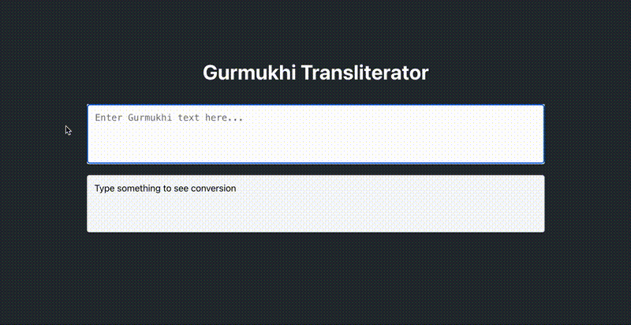

# Gurmukhi Voice Search & Transliteration Tools

A collection of tools for working with Gurmukhi (ਗੁਰਮੁਖੀ) text, currently featuring:

## 🟢 Available Now: Gurmukhi Transliterator
A web application that converts Gurmukhi text to ISO 15919 format in real-time.

## Demo


### Quick Start - Transliterator

#### Requirements
- Python 3.8 or higher
- Node.js 14 or higher
- npm

#### Running the Application
1. Clone the repository:
```bash
git clone https://github.com/yourusername/gurmukhi-voice-search.git
cd gurmukhi-voice-search
```

2. Start the backend:
```bash
cd backend
python -m venv venv
source venv/bin/activate  # On Windows use: venv\Scripts\activate
pip install -r requirements.txt
PYTHONPATH=$PYTHONPATH:. uvicorn src.api.main:app --reload --port 8000
```

2. In a new terminal, start the frontend:
```bash
cd frontend
npm install
npm start
```

The transliterator will be available at http://localhost:3000

See detailed setup instructions in:
- [Frontend README](frontend/README.md)
- [Backend README](backend/README.md)

## 🚧 Coming Soon: Voice Search
- Speech-to-text conversion using wav2vec2
- Semantic similarity matching
- Support for English and Punjabi voice input
- And more...

## Project Structure
```
.
├── frontend/          # React frontend for transliterator (AVAILABLE NOW)
├── backend/           # FastAPI backend for transliterator (AVAILABLE NOW)
└── voice_search/      # Voice search functionality (COMING SOON)
```

## Features

### Voice Search
- Speech-to-text conversion using wav2vec2
- Semantic similarity matching for search results
- Currently supports English voice input
- Planned support for Punjabi/Gurmukhi voice search

### Gurmukhi Phonetics
- Converts Gurmukhi (ਗੁਰਮੁਖੀ) text to ISO 15919 transliteration
- Handles complex cases:
  - Vowel sequences (ਭਾਈ -> bhāī)
  - Gemination (ਪੱਕਾ -> pakkā)
  - True diphthongs vs vowel sequences (ਕੌਰ -> kaur vs ਸਿਉ -> si'u)
  - More features coming soon...

## Usage

### Voice Search 
```python
from voice_search import process_audio

# Process an audio file
wav_file = "path/to/your/audio.wav"
result = process_audio(wav_file)
print(f"Search Results: {result}")
```

### Gurmukhi Phonetics
```python
from gurmukhi_phonetics import GurmukhiPhonetics

# Basic transliteration
text = "ਸਤਿ ਸ੍ਰੀ ਅਕਾਲ"
result = GurmukhiPhonetics.to_phonetic(text)
print(result)  # sati srī akāl

# Complex cases
text_with_diphthongs = "ਕੌਰ ਸਿਉ"
result = GurmukhiPhonetics.to_phonetic(text_with_diphthongs)
print(result)  # kaur si'u
```

## Installation

Currently in development. To set up locally:

```bash
# Clone the repository
git clone https://github.com/yourusername/gurmukhi-voice-search.git
cd gurmukhi-voice-search

# Create and activate virtual environment (optional but recommended)
python -m venv venv
source venv/bin/activate  # On Windows: venv\Scripts\activate

# Install dependencies
pip install -r requirements.txt
```

## Requirements

### System Requirements
- Python 3.8 or higher
- macOS, Linux, or Windows
- Microphone (for future live audio features)

### Python Dependencies
- transformers~=4.37.2 (for wav2vec2)
- torch~=2.2.0
- sounddevice~=0.4.6
- numpy~=1.24.3
- jellyfish~=1.0.3
- sentence-transformers~=2.5.1
- scipy~=1.11.4 (for audio processing)
- librosa~=0.10.1 (for audio file handling)
- datasets~=2.17.1
- accelerate~=0.27.2
- tqdm~=4.66.1

## Technical Stack

- **Speech Recognition**: 
  - wav2vec2 model from Hugging Face
  - Handles English speech-to-text (Punjabi support planned)

- **Text Processing**: 
  - Custom ISO 15919 transliteration system
  - Phonetic matching using jellyfish
  - Unicode support for Gurmukhi text

- **Audio Processing**:
  - sounddevice for audio capture
  - librosa for audio file handling
  - scipy for signal processing

- **Search & Matching**:
  - Sentence Transformers for semantic similarity
  - Custom phonetic matching for Gurmukhi

## Development

This project is under active development. Current focus areas:
- Expanding voice search to support Punjabi
- Implementing complete ISO 15919 transliteration rules
- Improving search accuracy and performance

## Contributing

Contributions are welcome! However, as this is a personal project with specific goals, please note:

### Before Contributing
1. **Start a Discussion**: Share your idea in the [Discussions](https://github.com/yourusername/gurmukhi-voice-search/discussions) tab first
2. **Wait for Feedback**: Get confirmation from the maintainer (me) before starting work
3. **Keep it Simple**: Break large changes into smaller, manageable pull requests

### Pull Request Guidelines
- Include a clear description of what your code does
- Add comments explaining complex logic
- Update tests and documentation if needed
- Be ready to explain your implementation decisions

### What I'm Looking For
- Bug fixes
- Performance improvements
- Documentation improvements
- New test cases

### What Might Get Rejected
- Major architectural changes without prior discussion
- Features that deviate from the project's core purpose
- Code that's difficult to understand or maintain
- Changes without proper documentation

Remember: I maintain the right to decline pull requests that don't align with the project's direction or that I'm not comfortable maintaining.

## License

Copyright (c) 2024 Himmat Singh Khalsa

This project is licensed under the MIT License - see the [LICENSE](LICENSE) file for details.

Note: This project was initiated by Himmat Singh Khalsa in December 2024 as an exploration 
of voice search capabilities for Gurmukhi text. The original implementation and 
ongoing development can be tracked through this repository's commit history.

## Project History

This project began in December 2024 as a way to solve the challenge of searching 
Gurmukhi text using voice input. Key milestones:

- December 18, 2024: Initial implementation of English voice search
- December 19, 2024: Development of ISO 15919 transliteration system

Follow the development:
- [Himmat Singh Khalsa's LinkedIn Profile](https://www.linkedin.com/in/himmatkhalsa/)
- [Project updates in Discussions tab](https://github.com/thehimmat/gurmukhi-voice-search/discussions)
- Feature requests and bug reports in [Issues](https://github.com/thehimmat/gurmukhi-voice-search/issues)

